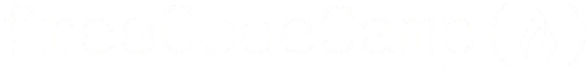

  

  <h1 align="center">Projetos Unidade 1, TDGI - 4° Semestre</h1>

    Descrição
     
    <a href="https://leticia-academico-uepb.github.io/projetos-unidade1-tdig/"><strong>Página Web »</strong></a>
      
    html
    &middot;
    css
    &middot;
    freecodecamp

---

### Contribuidores:

(<a href="#readme-top">voltar ao topo</a>)

