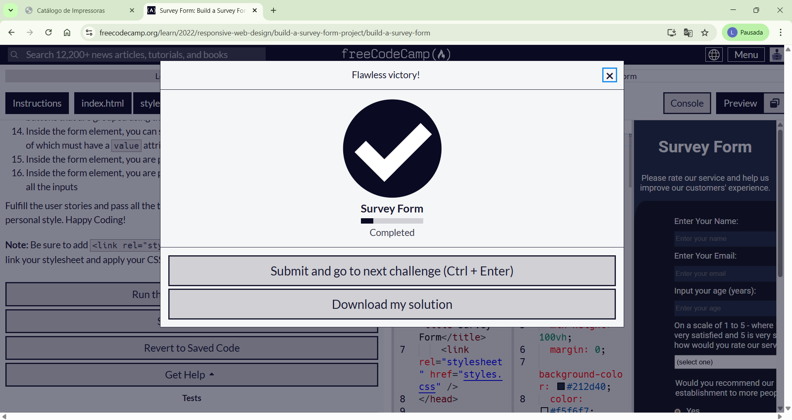
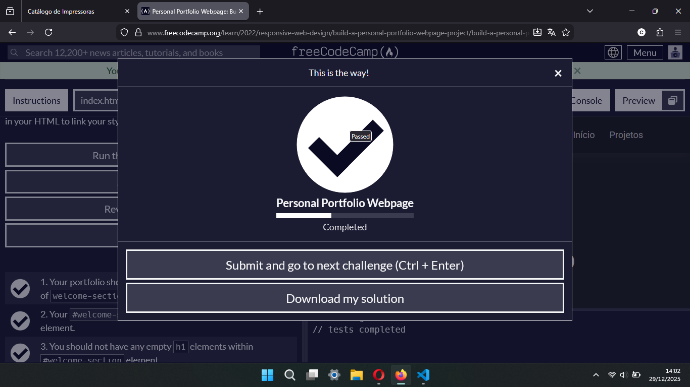
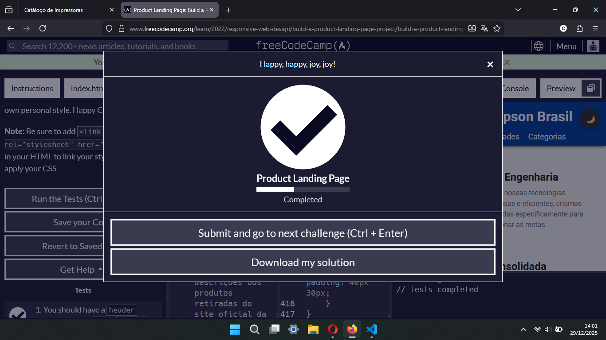

<a id="readme-topo"></a>

<div align="center">

  

  <h1 align="center">Projetos Unidade 1, TDGI - 4° Semestre</h1>

</div>

<p align="center">
    Realização dos 3 Desafios finais da trilha de Design Responsivo Web do FreeCodeCamp para avaliação da disciplina de Tecnologia de Desenvolvimento de Interface Gráfica.
    <br/>
    <a href="https://leticia-academico-uepb.github.io/projetos-unidade1-tdig/"><strong>Páginas Web Desenvolvidas»</strong></a>
    <br/><br/>
    <a href="#projeto-formulário">Formulário de Pesquisa</a>
    &middot;
    <a href="#projeto-portifolio">Portifólio Pessoal</a>
    &middot;
    <a href="#projeto-pg-produto">Página de Produto</a>
    &middot;
    <a href="#tecnologias-ferramentas"> Tecnologias e Ferramentas</a>
    &middot;
    <a href="#organizacao-repositorio">Organização do Repositório</a>
    &middot;
    <a href="#integrantes">Integrantes</a>
</p>

## Projetos Desenvolvidos

### Formulário de Pesquisa

<a id="projeto-formulario"></a>

Construir um aplicativo que seja funcionalmente semelhante ao [survery-form](https://survey-form.freecodecamp.rocks) e que contenha todos os requisitos listado em [build-survery-form](https://www.freecodecamp.org/portuguese/learn/2022/responsive-web-design/build-a-survey-form-project/build-a-survey-form).

<div align="center">

</div>

<br>

-   [Veja aqui o código html e css](projects/projeto-01/)
-   [Veja aqui a página web do projeto](https://leticia-academico-uepb.github.io/projetos-unidade1-tdig/projects/projeto-01/)

<p align="right">(<a href="#readme-topo">voltar ao topo</a>)</p>

---

### Página de Portifólio Pessoal

<a id="projeto-portifolio"></a>

Construir um aplicativo que seja funcionalmente semelhante ao [personal-portifolio](https://personal-portfolio.freecodecamp.rocks) e que contenha todos os requisitos listado em [build-a-personal-portifolio](https://www.freecodecamp.org/portuguese/learn/2022/responsive-web-design/build-a-personal-portfolio-webpage-project/build-a-personal-portfolio-webpage).

<div align="center">

</div>

<br>

-   [Veja aqui o código html e css](projects/projeto-02/)
-   [Veja aqui a página web do projeto](https://leticia-academico-uepb.github.io/projetos-unidade1-tdig/projects/projeto-02/)

<p align="right">(<a href="#readme-topo">voltar ao topo</a>)</p>

---

### Página Inicial para um Produto - Impressoras Epson

<a id="projeto-pg-produto"></a>

Construir um aplicativo que seja funcionalmente semelhante ao [product-landing-page](https://product-landing-page.freecodecamp.rocks/) e que contenha todos os requisitos listado em [build-a-product-landing-page](https://www.freecodecamp.org/portuguese/learn/2022/responsive-web-design/build-a-product-landing-page-project/build-a-product-landing-page).

<div align="center">

</div>

<br>

-   [Veja aqui o código html, css e javascript](projects/projeto-03/)
-   [Veja aqui a página web do projeto](https://leticia-academico-uepb.github.io/projetos-unidade1-tdig/projects/projeto-03/)

<p align="right">(<a href="#readme-topo">voltar ao topo</a>)</p>

## Tecnologias e Ferramentas

<a id="tecnologias-ferramentas"></a>

#### Tecnologias

-   **HTML**
-   **CSS**
-   **Javascript** (extra)

#### Ferramentas

-   **Visual Studio Code IDE**
-   **Live Server** (extensão)
-   **FreeCodeCamp**

## Organização do Repositório

<a id="organizacao-repositorio"></a>

```
C:
├───assets
│   ├───css
│   ├───icons
│   └───images
├───docs-readme
│   └───images
└───projects
    ├───projeto-01
    ├───projeto-02
    └───projeto-03
```

## Integrantes

<a id="integrantes"></a>

-   [Laryssa Dantas Ramos](https://github.com/laryssadrr)
-   [Letícia Barbosa M. da Cruz](https://github.com/daCruzZzLeticia)

<p align="right">(<a href="#readme-topo">voltar ao topo</a>)</p>
